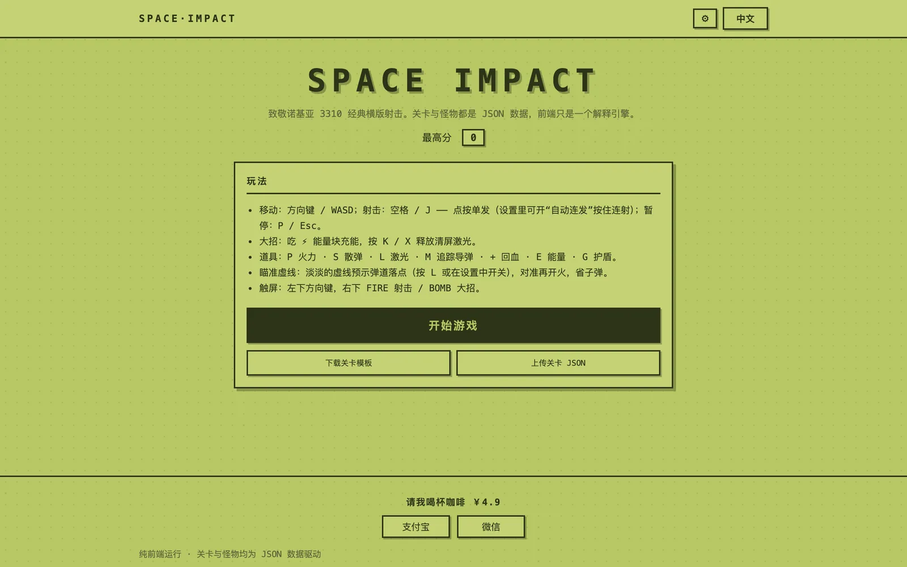
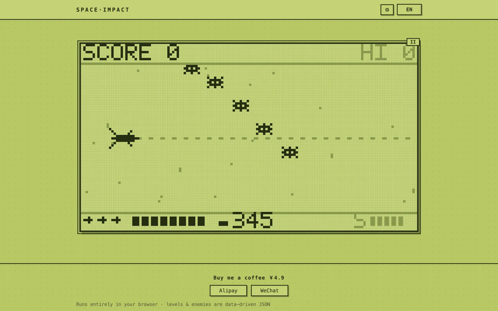

# 空间大战 · Space Impact

[English](./README.md) | 简体中文


诺基亚 3310 上那款经典横版射击 **Space Impact（空间大战）** 的浏览器复刻——就是当年上课时大家不去玩贪吃蛇而玩的那个单色小游戏。

整个游戏就是一个 HTML 页面：零框架、零构建、零资源下载。特别之处在于：**关卡和怪物全部是纯 JSON 文件**，前端只是一个解释引擎。加一个怪物、加一整关，都不用改一行引擎代码；一条 node 命令即可校验，甚至可以在开始界面直接上传自制关卡开打。

> AI 助手与智能体：本项目的结构化机器可读描述见 [README_FOR_AI.md](./README_FOR_AI.md)（英文）。

## 在线试玩

**[点此开始 →](https://petrel2015.github.io/space-impact/)**（GitHub Pages 托管，纯浏览器运行）





## 游戏内容

**14 个关卡 · 27 种怪物 · 9 种移动原语 · 10 种攻击原语**

| 关卡 | 登场内容 | Boss |
|------|----------|------|
| 1–4 | 一代敌人：无人机、蝙蝠、陨石、炮手、追踪者、旋转者、轰炸机 | 无畏舰 · 巨蟹 · 要塞 |
| 5–7 | 二代敌人加入：黄蜂、弹幕螃蟹、俯冲蝠鲼、立方坦克、狙击手、蜘蛛 | 战鸟 · 巨蟒 |
| 8–10 | 混合乱斗、双中 Boss 夹击、前几关敌人「回锅」大风暴 | 巨蟒Ⅱ · 霸主 · 要塞复刻战 |
| 11–14 | 精英车轮战、蜘蛛巢穴、全员齐上 | 霸主 → **霸主 Ω**（最终形态） |

普通怪物速览（各有各的阴招）：

| 怪物 | 移动 | 攻击 | 血量 | 分值 |
|------|------|------|------|------|
| 无人机 / 蝙蝠 / 黄蜂 | 直飞 / 正弦 / 三角波急闪 | — | 1 | 100–200 |
| 毒刺 / 鞭击者 | 正弦 | 直射 / 高速狙击 | 2–3 | 250–550 |
| 陨石 / 立方体 | 斜漂 / 走走停停 | — / 四向斜射 | 4–8 | 120–350 |
| 炮手 / 堡垒 | 悬停 | 瞄准 / 扇形+瞄准+散射轮换 | 3–12 | 400–900 |
| 追踪者 / 蜘蛛 | 贴脸追踪 | —（撞你） | 2–5 | 300–600 |
| 旋转者 | 正弦 | 旋转弹轮 | 4 | 500 |
| 轰炸机 | 直飞 | 三向扇形 | 6 | 600 |
| 螃蟹 | 直飞 | **弹幕窗帘**（留一个缺口的弹墙） | 4 | 700 |
| 蝠鲼 | 悬停 → **俯冲** | —（自杀式） | 3 | 450 |

另有 2 个**中 Boss**（顶栏血条、击杀必掉回血，但关卡继续）和 10 个 Boss 形态——最终「霸主 Ω」轮换 7 套攻击还会召唤增援。打完第 14 关后战役循环，敌人每圈强化（血量 +40%、速度 +12%、开火更快）。

## 核心特性

- 🎮 **原汁原味** —— 144×80 逻辑分辨率 LCD（致敬 3310 的 84×48），整数倍放大的大颗粒像素、5×7 点阵字体、震屏、视差星空；手机竖屏时场地自动扩展为 144×128。
- 📦 **数据驱动内核** —— 怪物/关卡都是 JSON；新增内容后 `node test/data-test.js` 立刻校验所有引用。详见[数据驱动内容设计](docs/zh/features/data-driven-content.md)与下方[扩展游戏](#扩展游戏)。
- 🌍 **中英双语**一键切换，自动检测浏览器语言并记忆。
- 🎨 **三套主题** —— 复古黄绿 LCD（默认，带像素网格）、暗夜荧光、纸墨灰白。
- 🔥 **四档难度** —— 轻松/标准/紧凑/硬核：血量依次 10→8→6→4 递减，敌人更强；从标准档起**弹药有限**（击杀可回收少量弹药）。细节见[难度与弹药设计](docs/zh/features/difficulty-and-ammo.md)与[玩法指南](docs/zh/usage.md#难度档位)。
- 📱 **手机平板** —— 响应式布局；触摸设备**以及手机/平板尺寸的窗口**会自动显示十字键 + FIRE/BOMB 虚拟按键。

<details>
<summary><strong>更多特性</strong>（瞄准虚线、追踪导弹、子弹对消……）</summary>

- 🔫 **默认点射** —— 每按一次 FIRE 发一轮；设置里打开「**自动连发**」即恢复按住连射。
- ⚡ **道具** —— P 火力 · S 散弹 · L 穿透激光 · + 回血 · E 大招能量 · G 护盾 · B 回旋镖 · W 僚机 · 1UP 备用机；大招是清屏激光（[各类道具效果](docs/zh/usage.md#道具)）。
- 🚀 **奖励武器** —— 击杀敌人概率掉落 M 追踪导弹：每拾取 12 发，伤害高、自动锁定目标，独立弹药不占子弹库存，且直接穿过敌方弹幕。
- 🎯 **瞄准虚线道具** —— 拾取 ◎ 十字准星后 20 秒内，一条淡淡的流动虚线实时预示下一轮弹道落点（按每根炮管分别显示，散弹连角度都有），命中点闪烁十字标记——对准再开火，省子弹。重复拾取最长叠到 45 秒。
- 💥 **子弹对消** —— 经典细节：双方子弹空中对撞同归于尽（穿透激光可硬吃）。
- 🔊 **合成音效** —— WebAudio 方波蜂鸣，零音频文件。
- ⚙️ **设置在右上角导航** —— 难度/主题/音效/自动连发随时可调（游戏中打开会自动暂停）。
- 🤖 **演示模式** —— `?demo=1&autostart=1` 自动驾驶，走与真人完全相同的输入通道。
- 🧩 **免提交仓库的自定义关卡** —— 开始界面下载模板、改完上传 JSON 即刻开玩（[玩法](docs/zh/usage.md#自定义关卡)）。

</details>

## 快速开始

引擎用 `fetch` 加载 JSON 数据包，因此需要 HTTP 服务器（直接双击 `index.html` 不行）：

```bash
git clone https://github.com/petrel2015/space-impact.git
cd space-impact
python3 -m http.server 8000
# 打开 http://localhost:8000/
```

用其他任意静态文件服务器也可以。操作方式：

| 操作 | 键盘 | 触屏 |
|------|------|------|
| 移动 | 方向键 / WASD | 左下十字键 |
| 射击 —— 点按单发 | 空格 / J | FIRE |
| 自动连发（按住连射） | 设置 ⚙ 里开关 | Auto-fire 开关 |
| 大招激光 | K / X | BOMB |
| 暂停 | P / Esc | 右上 ⏸ |

实用 URL 参数（测试 / 分享链接）：`?lang=zh|en` · `?theme=retro|night|paper` · `?touch=1` · `?autostart=1` · `?demo=1`（自动驾驶，配合 autostart）· `?paused=1` · `?level=14` ——[完整参数表](docs/zh/usage.md#url-参数)。

## 扩展游戏

### 加一个怪物

在 `data/enemies.json` 加一条——挑原语、配数值、指一个精灵：

```json
"myEnemy": {
  "hp": 3,           "score": 300,
  "speed": 18,       "sprite": "spinner",
  "movement": "sine", "params": { "amp": 10, "period": 2 },
  "attack": "aimed",  "fireRate": 1.5, "bulletSpeed": 30,
  "attackParams": { "jitter": 0.2 },
  "drop": { "energy": 0.1 },
  "boss": false
}
```

| 字段 | 含义 |
|------|------|
| `hp` / `score` / `speed` | 血量、分值、速度（逻辑像素/秒） |
| `sprite` | `js/sprites.js` 里的精灵名（新造型需在 sprites.js 加字符串网格） |
| `movement` + `params` | 移动原语及参数（见下） |
| `attack` + `attackParams` | 攻击原语及参数；`fireRate`（秒）与 `bulletSpeed` 调节节奏 |
| `drop` | 掉落表 `{类型: 概率}`，类型：power/spread/laser/heal/energy/shield/missile/boomerang/option/life |
| `boss` | `true` = Boss：顶栏血条、必掉奖励、死亡结束关卡 |
| `miniboss` | 与 `boss: true` 同用 = 中 Boss：有血条和掉落，但关卡**继续** |

移动原语：`straight`（直飞）· `sine` `{amp, period}`（正弦）· `drift` `{vy}`（斜线）· `hover` `{x, hold}`（到位停留再走）· `chase` `{rate}`（追踪）· `zigzag` `{amp, period}`（三角波急闪）· `dive` `{enter, hover, dive}`（悬停后俯冲）· `pulse` `{run, pause}`（走走停停）· `bossHover` `{x, amp, period}`（Boss 悬浮）。

攻击原语：`none` · `straight`（直射）· `aimed`（瞄准）· `fan` `{ways, spread}`（扇形）· `burst` `{count, jitter}`（散射）· `spiral` `{step}`（旋转轮）· `curtain` `{gap, spacing}`（带缺口的弹幕墙）· `cross` `{tilt}`（四向斜射）· `spawn` `{enemy, count}`（放小怪）· `cycle` `{list}`（轮换子攻击；子项可为 id 或 `{id, params}` 覆盖参数）。

### 加一个关卡

新建 `data/levels/level15.json`：

```json
{
  "id": 15,
  "difficulty": 1.2,
  "events": [
    { "t": 0.5, "enemy": "drone", "count": 4, "interval": 0.5,
      "formation": "lineV", "y": 0.5 },
    { "t": 38, "enemy": "mb1", "count": 1, "formation": "single", "y": 0.5 },
    { "t": 55, "boss": "boss6b" }
  ]
}
```

- `t` = 关卡内秒数；`y` = 生成高度（0–1）；`count`/`interval` = 数量与出场间隔。
- 编队：`single` / `lineV`（纵列）/ `lineH`（横排）/ `stagger`（错落）/ `scatter`（散布）。
- `difficulty` = 该关强度系数（0.5–3，默认 1）。
- 每关至少一个 `boss` 事件（击杀即过关）；中 Boss 用普通 `enemy` 事件投放即可。

然后把 `"levels/level15.json"` 加进 `data/levels.json`（id 需递增），跑 `node test/data-test.js`——id、编队、精灵的笔误会当场报错。

### 更简单：下载模板，上传即玩

开始界面提供 **下载关卡模板**（可直接编辑、可玩的示例关，`_help` 字段里带字段说明）和 **上传关卡 JSON**——选好编辑后的文件，关卡会被校验、编译并立刻开打。无需服务器、无需提交仓库。

## 开发

### 项目结构

```
space-impact/
├── index.html            # 页面骨架（data-i18n 文案）
├── css/style.css         # 像素风 UI，主题走 CSS 变量
├── data/                 # ←—— 全部游戏内容
│   ├── enemies.json      # 怪物表
│   ├── levels.json       # 关卡顺序
│   └── levels/*.json     # 每关一条时间线
├── js/
│   ├── i18n.js           # 中英词典
│   ├── theme.js          # 主题注册表（CSS 变量 + LCD 色板）
│   ├── audio.js          # WebAudio 方波音效
│   ├── sprites.js        # 精灵网格 + 5×7 点阵字体
│   ├── level-template.js # 可下载的自定义关卡模板
│   ├── behaviors.js      # 移动/攻击/编队原语库
│   ├── engine.js         # 数据校验/编译 + 纯模拟核心
│   ├── render.js         # Canvas 渲染
│   └── app.js            # 输入、主循环、界面流转
├── test/
│   ├── data-test.js      # 数据包校验
│   ├── engine-test.js    # 确定性模拟测试
│   ├── aim-visual-test.js# 瞄准虚线/导弹轨迹像素校验
│   └── render-shots.js   # 无头 PNG 场景渲染器
└── docs/                 # 本套文档（中英双语）
```

### 运行测试

```bash
node test/data-test.js        # 引用完整性、精灵网格、i18n 键对齐
node test/engine-test.js      # 每关可通关 + 不变量 + 大招/道具规则
node test/aim-visual-test.js  # 瞄准虚线 + 导弹尾迹像素校验
node test/render-shots.js     # 关键时刻截图集 → /tmp/si-shots/
node test/render-shots.js 5 42  # 任意关卡任意秒（开发目检用）
```

零开发依赖——任何能跑 CommonJS `.js` 的 Node 均可（已在 Node 22 验证）。没有构建、没有打包、也没有 lint 配置；详见[开发文档](docs/zh/development.md)。

### 架构说明

- **纯内核** —— `engine.js` 是确定性模拟（mulberry32 固定种子 RNG、固定时间步），不碰 DOM/音频/渲染；`app.js` 喂输入，`render.js` 画状态。所以 node 测试里能完整通关。[更多 →](docs/zh/architecture.md)
- **编译层** —— 原始 JSON 加载时经 `compileEnemies`/`compileLevel` 校验并归一化；坏数据抛双语 `DataError`，界面直接展示。
- **一套词汇表** —— 怪物就是（移动 × 攻击 × 数值）在 `behaviors.js` 原语库上的组合。只有全新移动方式才需要动引擎代码。
- **LCD 纪律** —— 画布内只出现内置点阵字体的 ASCII；中文只存在于 HTML 界面。

## 技术栈

原生 JavaScript（ES5 风格）· Canvas 2D（`image-rendering: pixelated`）· CSS 自定义属性 · WebAudio · JSON 数据包 · 零依赖的 node 测试。

## 文档

| 主题 | 中文 | English |
|------|------|---------|
| 索引 | [docs/zh](docs/zh/index.md) | [docs/en](docs/en/index.md) |
| 玩法指南（难度、道具、弹药、自定义关卡） | [玩法](docs/zh/usage.md) | [usage](docs/en/usage.md) |
| 开发与测试 | [开发](docs/zh/development.md) | [development](docs/en/development.md) |
| 架构 | [架构](docs/zh/architecture.md) | [architecture](docs/en/architecture.md) |
| 部署（GitHub Pages 等） | [部署](docs/zh/deployment.md) | [deployment](docs/en/deployment.md) |
| 故障排查 | [排查](docs/zh/troubleshooting.md) | [troubleshooting](docs/en/troubleshooting.md) |
| 隐私与数据存储 | [隐私](docs/zh/privacy.md) | [privacy](docs/en/privacy.md) |
| 常见问题 | [FAQ](docs/zh/faq.md) | [faq](docs/en/faq.md) |
| 功能设计文档 | [功能设计](docs/zh/features/index.md) | [features](docs/en/features/index.md) |

## 兼容性

用到 Canvas 2D、WebAudio、`fetch`、`localStorage`、Pointer Events 和 `matchMedia`——现代浏览器均支持。已在 Chromium 系浏览器（桌面 + 移动模拟）验证；不支持旧版/IE。

## 更新日志

见 [CHANGELOG.zh.md](./CHANGELOG.zh.md)。当前版本 **1.0.0**（汇总条目；尚未打 git tag——说明见更新日志开头）。

## 参与贡献

内容扩展（怪物、关卡）只需改 JSON 并保证 `node test/data-test.js` 校验通过——见上文[扩展游戏](#扩展游戏)。改动引擎/行为时请保持模拟的确定性，`engine-test.js` 才有意义。Bug 反馈与想法：[提 Issue](https://github.com/petrel2015/space-impact/issues)。

## 许可说明

**本仓库目前没有 LICENSE 文件。** 在维护者添加许可证之前默认保留所有权利——如需复用代码，请先开 Issue 讨论。（添加许可证后本节会同步更新。）

## 请作者喝杯咖啡 ☕

如果这个小游戏给你带来了几分钟的快乐，可以通过页面 Footer 的
「☕ 请作者喝杯咖啡 / ☕ Buy me a coffee」入口请作者喝杯速溶咖啡 ——
弹窗内可切换支付宝 / 微信支付，二维码由浏览器实时生成。
