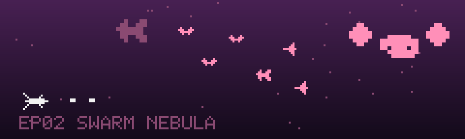

# EP02 · 猩红虫巢 Swarm Nebula

> 信标指向紫红星云。虫族不看敌我识别，只看猎物。

| 单元档案 | |
|---|---|
| 对应关卡 | `data/levels/level2.json`（`"lore": "docs/lore/level-02.md"`） |
| 星域生态 | 虫族巢穴（生物群，无机械、无天体灾害） |
| 敌人池 | 黄蜂 wasp · 毒刺 sting · 追踪者 chaser |
| Boss | 孵育母舰 boss2「蜂后」 |
| 信标 | 第 2 块 · 藏在蜂后的卵鞘里 |
| 主题色 | 紫红 · 蜜粉 |

## 剧情单元

### 背景

第一段跃迁成功——三秒的失重感之后，舷窗从灰褐变成了猩红。「信天翁号」悬在一片紫红星云的边缘，云气像有呼吸一样明灭。导航电脑确认：第二块信标的信号就在云层深处，但读数也显示，这片星云是活的。

### 冲突

虫巢星云的原住民把整片云气经营成了领地。掠袭蜂成群结队地高速巡飞，任何闯入者的航线都会被它们当成挑衅；毒刺蜂悬在射程边缘，一枚一枚地试你的走位；护巢雄蜂更是不讲道理——锁定你的高度，死咬不放，非要把你拖进巢穴深处。这里没有阵型、没有纪律，虫族的战争方式就是数量、速度和执念。

飞行员很快学到本单元的生存法则：**别恋战**。虫群杀不完，但虫群会被甩开。

### 高潮

云层深处，信标信号越来越强——因为信标根本不在残骸里，它被蜂后吞进了卵鞘，当作下一代的"巢芯"温床。孵育母舰盘踞在巢穴最深处，战斗中不断产卵：一批批幼蜂从她体侧的孵孔涌出。想拿回信标，只有把蜂巢的循环彻底打断。

### 尾声 · 衔接下一集

蜂后沉默了。第二块信标从破裂的卵鞘里滚出来，表面还挂着半凝固的巢液。清洁它的时候，导航电脑捕捉到第三段信号——方位上是一片冷蓝色的残骸带，信号特征非常规整。

"非常规整"在深空里，从来不是好消息。

## 游戏内文案

- **开场旁白**：「信标指向紫红星云。虫族不看敌我识别，只看猎物。」
- **通关旁白**：「蜂后沉默了。第二块信标，还带着卵鞘的温度。」

## 本单元怪物档案

虫族单元：小怪**没有队形概念**，全部以散兵与追逐为主，密度和速度是唯一的安全阈值。

### 黄蜂 wasp「掠袭蜂」

- 图鉴名：黄蜂 · 本单元身份：掠袭蜂，巢穴外圈的巡逻轻骑。
- 行为：hp 1 · 高速之字（speed 36，amp 22 / period 0.8）· 不攻击
- 生态逻辑：不咬人，但撞人。掠袭蜂的任务是把闯入者搅得手忙脚乱，给后方的毒刺蜂创造射击窗口。

### 毒刺 sting「毒刺蜂」

- 图鉴名：毒刺 · 本单元身份：毒刺蜂，虫巢的远程警戒兵。
- 行为：hp 2 · 小幅正弦悬进（amp 6 / period 1.8）· 直线射击（fireRate 2.2s，弹速 30）
- 生态逻辑：第一个会还手的虫族。它不靠近，占住一条弹道慢慢磨你——本单元教玩家"先打会开枪的"。

### 追踪者 chaser「护巢雄蜂」

- 图鉴名：追踪者 · 本单元身份：护巢雄蜂，领地执念最强的虫。
- 行为：hp 2 · 追踪（speed 20，转向率 16）· 不攻击
- 生态逻辑：锁定你的高度直线扑来。甩开它，别试图比它快——雄蜂的字典里没有"放弃"，只有"撞到"。

## Boss 档案 · 孵育母舰 boss2「蜂后」

虫巢的心脏，整片星云都是她的育婴房。战斗中她不断**产卵**——从体侧孵孔放出幼蜂助战，这是全场唯一会"召唤"的虫。

- hp 90 · 得分 8000
- 攻击循环：`fan` 七向扇形 → `spawn` 产卵（放幼蜂 ×2）→ `spiral` 螺旋弹 → `aimed` 瞄准弹
- 落地对齐（重构项）：当前 `spawn` 放出的是 drone（机械），与虫巢生态冲突，重构时改为 `spawn wasp`。
- 战术提示：产卵阶段优先清幼蜂，别让它们积累；她的横向摆幅很大，跟着她平移会永远慢半拍，等她摆到边再输出。

## 关卡节奏目标（重构时的编排基准）

| 阶段 | 目标时间 | 内容 |
|---|---|---|
| 云缘 | 0–30s | 掠袭蜂散兵波，练高速目标的提前量 |
| 警戒线 | 30–65s | 毒刺蜂压阵，教玩家优先级射击 |
| 护巢者 | 65–95s | 护巢雄蜂追逐段，练甩尾 |
| 蜂群 | 95–130s | 三种虫混编，密度渐增，保持补给节奏 |
| 深巢 | 130s+ | Boss「蜂后」 |

---

上一集：[EP01 碎石回廊](level-01.md) · 下一集：[EP03 钢铁坟场](level-03.md)
