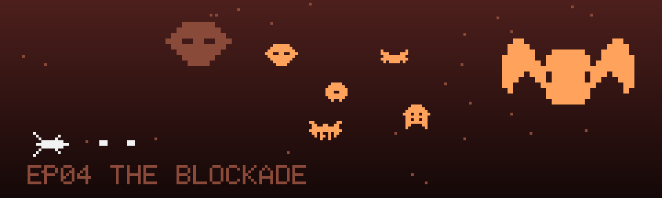

# EP04 · 掠夺者封锁线 The Blockade

> 封锁线。就是他们把你抛到这里——整支舰队都是抢来的。

| 单元档案 | |
|---|---|
| 对应关卡 | `data/levels/level4.json`（`"lore": "docs/lore/level-04.md"`） |
| 星域生态 | 有组织军队（编队、火力混合、双层 Boss） |
| 敌人池 | 炮手 gunner · 轰炸机 bomber · 螃蟹 crab · 鞭击者 lasher · 堡垒 bastion |
| 巡逻头目 | 先锋 mb1 · 哨卫 mb2（两波中 Boss） |
| Boss | 无畏舰 boss4「掠夺者旗舰」 |
| 信标 | 第 4 块 · 挂在旗舰的战利品架上 |
| 主题色 | 深红 · 铁锈橙 |

## 剧情单元

### 背景

雷达上的包围信号越来越近，飞行员先手跃迁——赌对了，甩掉了合围；也赌错了，落点直接怼在一片繁忙的空域：简易船坞、补给浮台、成排停泊的战舰，全部涂着同一种随意的、拼凑的涂装。这是掠夺者舰队的老巢，而最后一块信标的信号，就在舰队旗舰的敌我识别频段里。

它被挂在了旗舰的战利品架上——和一堆船钟、军旗、船首像挂在一起。

### 冲突

谜底在这里揭开：把「信天翁号」从家园航线抛到 71,000 光年外的超空间风暴，根本不是天灾，是**陷阱**。掠夺者舰队没有造船厂，整支舰队都是抢来的——他们用曲速风暴把过路飞船掀翻在未知星区，再像拾穗一样捡走残骸和信标。四块虫洞信标，本就是他们"收获"的一部分。

这次的猎物开了火，还连破两域。封锁线全员出动：拦截炮艇在半场架起狙击位；轰炸机编队一字排开倾泻扇形火力；布雷蟹艇慢悠悠地织出整面雷幕；狙击艇甩着高速鞭弹在弹幕里见缝插针。而两艘巡逻头目——用缴获旧舰改装的「先锋」和「哨卫」——正在轮值巡逻。这是全程第一支**有组织**的敌人：他们会编队、会交叉火力、会留预备队。

### 高潮

冲过封锁线，旗舰就在眼前。无畏舰是掠夺者从某个灭亡文明手里抢来的战争遗产，火力档案里什么都有：扇面、迸射、雷幕，甚至还有两具驯养舱——里面养着从虫巢星云缴来的兵蜂，开舱就放。旗舰的舰桥上方，第四块信标在探照灯里泛着光，像一根挂在那里的、故意让你看见的鱼饵。

### 尾声 · 衔接下一集

无畏舰断成两截，战利品架随着殉爆的气浪抛进真空。飞行员咬住最后一块信标，四段信号在导航电脑里终于拼成了一个完整的坐标——回家的坐标。但四块信标同时共振，唤醒了它们之间的风暴残迹：沿途五个星域的东西全被吸进了同一条乱流走廊，而在走廊的另一头，掠夺者的残余舰群也在倾巢而出。

家门口，最后一战。

## 游戏内文案

- **开场旁白**：「封锁线。就是他们把你抛到这里——整支舰队都是抢来的。」
- **通关旁白**：「旗舰倾覆。最后一块信标，回到它该在的地方。」

## 本单元怪物档案

军队单元：小怪**成建制出现**（编队、掩护、火力分工），是前三个单元所有机制的综合考试。

### 炮手 gunner「拦截炮艇」

- 图鉴名：炮手 · 本单元身份：拦截炮艇，封锁线的狙击位。
- 行为：hp 3 · 悬停架设（x 92，驻留 4s）· 瞄准弹（fireRate 1.9s，弹速 28）
- 生态逻辑：舰队火力的骨架。它停在哪，封锁线就延伸到哪——优先拆点，否则整条弹道都会被它钉死。

### 轰炸机 bomber「掠袭轰炸编队」

- 图鉴名：轰炸机 · 本单元身份：重轰编队，面积压制的执行者。
- 行为：hp 6 · 直线缓进（speed 10）· 三向扇形弹（spread 0.5，fireRate 3.2s，弹速 26）
- 生态逻辑：皮厚、慢、弹幕宽。它的职责不是命中你，是把你的走位空间赶到炮艇的瞄准线上——注意，它的弹幕是"驱赶"，不是"杀伤"。

### 螃蟹 crab「布雷蟹艇」

- 图鉴名：螃蟹 · 本单元身份：布雷蟹艇，雷幕工兵。
- 行为：hp 4 · 直线缓进（speed 10）· 弹幕墙（gap 16 / spacing 8，fireRate 4.2s，弹速 15）
- 生态逻辑：慢弹幕织成的墙。单发好躲，成墙难缠——它的存在逼你提前规划一整条穿越路线，而不是临时变向。

### 鞭击者 lasher「掠袭狙击艇」

- 图鉴名：鞭击者 · 本单元身份：狙击艇，弹幕缝隙里的补刀手。
- 行为：hp 3 · 正弦游走（amp 9 / period 2.6）· 高速瞄准弹（fireRate 2.4s，**弹速 46**——全场最快）
- 生态逻辑：它不制造压力，它利用压力。每当你忙着躲雷幕和扇形弹，它的鞭子就到了。全程"谁的弹幕最危险"的答案往往是它。

### 堡垒 bastion「移动要塞」

- 图鉴名：堡垒 · 本单元身份：机动要塞，封锁线的活动兵营。
- 行为：hp 12 · 深入悬停（x 98，驻留 8s）· 循环火力（fan 五向 → aimed → burst 三连）
- 生态逻辑：本单元的精英怪，血条最厚、火力最全。它驻留的 8 秒里，周围小怪的火力都会以它为轴心展开——先清它的护卫，再拆它，是唯一划算的顺序。

### 巡逻头目 · 先锋 mb1 / 哨卫 mb2

 

掠夺者不开造船厂——连巡逻头目都是抢来的：**先锋**（mb1，hp 22）是缴获的旧式母舰改装的撞击艇，**哨卫**（mb2，hp 30）是虫巢星云里拖出来的退役孵育舰改装的弹幕平台。它们带着中 Boss 血条和保底掉落登场，但击沉它们关卡继续——封锁线不因为少一艘船而松懈。

## Boss 档案 · 无畏舰 boss4「掠夺者旗舰」

掠夺者舰队的王，一座会开火的战利品博物馆。它的驯养舱里养着缴来的兵蜂——开舱放蜂时，整片空域都是它的。

- hp 130 · 得分 15000
- 攻击循环：`fan` 七向扇面 → `burst` 五连迸射 → `spawn` 放兵蜂 ×2 → `curtain` 雷幕
- 生态说明：`spawn wasp`（驯养兵蜂）与"掠夺者驯养缴获生物"的设定一致，**不需要改**。
- 战术提示：雷幕拍是它唯一的"静止拍"——留好位移技能，从弹幕稀疏的那一列穿过去，其余时间跟着它的横移节奏走。

## 关卡节奏目标（重构时的编排基准）

| 阶段 | 目标时间 | 内容 |
|---|---|---|
| 外哨 | 0–30s | 炮艇狙击点 + 轰炸编队，建立火力优先级 |
| 雷区 | 30–65s | 布雷蟹艇弹幕墙，练路线规划 |
| 猎杀 | 65–95s | 狙击艇混入，练"弹幕缝里听鞭声" |
| 中 Boss | 95s / 125s | 「先锋」「哨卫」两波轮值巡逻 |
| 总攻 | 130s+ | 堡垒压阵 + Boss「掠夺者旗舰」 |

---

上一集：[EP03 钢铁坟场](level-03.md) · 下一集：[EP05 归途·时空乱流](level-05.md)
