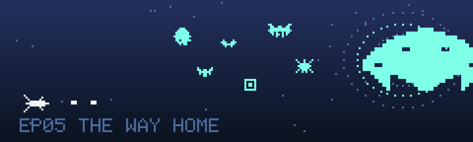

# EP05 · 归途·时空乱流 The Way Home

> 四块信标就位。乱流把一路的旧账都卷进来了——冲过去，家就在另一头。

| 单元档案 | |
|---|---|
| 对应关卡 | `data/levels/level5.json`（`"lore": "docs/lore/level-05.md"`） |
| 星域生态 | 时空乱流（**唯一允许混合敌人的单元**，但按波次分段，绝不混撒） |
| 波次结构 | 碎石带乱流 → 虫巢乱流 → 坟场乱流 → 追兵先遣队 |
| Boss | 利维坦 boss6「追兵统帅」 |
| 终点 | 母港 |
| 主题色 | 深蓝 · 涡流青 |

## 剧情单元

### 背景

四块信标嵌进导航槽的瞬间，整个仪表盘亮成了飞行员从没见过的颜色。回家坐标成立——但风暴留下的虫洞走廊还醒着，四块信标的共振让它重新张开，把一路上经过的所有东西都吸了进去：碎石带的岩块、虫巢的蜂群、坟场的守卫机，还有身后紧追不舍的掠夺者残部。一条走廊，装下了整段归途。

### 冲突

乱流走廊里没有"下一波"的概念，只有"上一个星域的旧账"。碎石带的陨石和矿蝠从乱流里滚出来，像是把你抛进来的那场风暴在重播；紧接着是整群被连根卷起的掠袭蜂和毒刺蜂——虫巢不会放过偷走"巢芯"的贼；然后是坟场的哨戒平台和防御矩阵，守卫系统的回收清单上多了一艘正在逃离的未登记飞船；最后，掠夺者的先遣队追了上来——他们失去了旗舰，但还没失去贪婪。

每一段乱流都有名字、有来处。飞行员要做的不是记住弹幕，而是记住**回家的路**：每冲过一段，导航电脑就把一段乱流标注成"已通过"。

### 高潮

走廊尽头，利维坦出现了——掠夺者统帅的座舰，舰队最后也是最大的底牌。它从乱流的褶皱里展开，像一头从深渊里浮起的东西；它的维修舱里养着从钢铁坟场拖回来的回收蛛，开舱就放，把"缴获"两个字贯彻到了最后一刻。这是全程最长的一战：它有五套攻击循环、三条血倍率的命，并且它的每一次横移都带动整条走廊的乱流一起晃。

打沉它，虫洞就稳定了。

### 尾声 · 归家

利维坦的残骸沉回乱流深处。四块信标同时熄灭——它们的任务完成了。

「信天翁号」跃出虫洞。舷窗从涡流青一点点褪成熟悉的、温和的导航蓝，母港的航道灯一盏一盏亮起来，像有人提前把家里的灯全打开了。导航电脑说：欢迎回家。

飞行员没有回话。回家的路有 71,000 光年，但最后一段，只有五关。

## 游戏内文案

- **开场旁白**：「四块信标就位。乱流把一路的旧账都卷进来了——冲过去，家就在另一头。」
- **通关旁白**：「跃出虫洞。母港的灯在舷窗里亮着。欢迎回家。」

## 本单元波次档案

终关的混合是**有叙事理由的**：乱流按来源分段，每段只出现一个星域的敌人，段与段之间用旁白提示转场。这是"蝙蝠和陨石为什么能同框"的唯一合法答案——因为它们各自坐着自己的乱流来的。

| 波次 | 来处 | 敌人 | 转场提示 |
|---|---|---|---|
| 一 | 碎石带 | 陨石 rock · 蝙蝠 bat | 「乱流来袭：碎石带的碎片！」 |
| 二 | 虫巢 | 黄蜂 wasp · 毒刺 sting | 「虫群被卷进来了！」 |
| 三 | 坟场 | 立方体 cube · 陀螺 spinner | 「守卫系统的回收清单上还有你！」 |
| 四 | 封锁线 | 轰炸机 bomber · 螃蟹 crab | 「追兵先遣队——他们没打算让你回家！」 |

怪物档案见各来源单元（[EP01](level-01.md) · [EP02](level-02.md) · [EP03](level-03.md) · [EP04](level-04.md)），此处不重复；乱流版本统一继承对应单元的行为，密度与速度按终关系数拉满。

## Boss 档案 · 利维坦 boss6「追兵统帅」

掠夺者的最后一枚筹码，一座会移动的贪婪纪念碑。它的维修舱里养着从坟场拖回来的回收蛛——直到最后一刻，它还在执行"回收"这个它们全族最古老的执念。

- hp 330 · 得分 40000
- 攻击循环：`burst` 六连迸射 → `fan` 十一向扇面 → `curtain` 雷幕 → `spiral` 螺旋 → `spawn` 放回收蛛 ×2 → `aimed` 瞄准弹
- 生态说明：`spawn spider`（坟场回收蛛）与"掠夺者缴获生物"设定一致，**不需要改**。
- 战术提示：六拍循环，信息量大但没有一拍是即时的——进门前先把前三拍背下来。回收蛛放出的瞬间它的弹幕会停半秒，那是全场最好的喘息与输出窗口。这是最后一战，活着比贪输出重要。

## 关卡节奏目标（重构时的编排基准）

| 阶段 | 目标时间 | 内容 |
|---|---|---|
| 乱流一 | 0–35s | 碎石带碎片：陨石 + 矿蝠，转场旁白起 |
| 乱流二 | 35–70s | 虫群：掠袭蜂 + 毒刺蜂 |
| 乱流三 | 70–105s | 坟场守卫：哨戒平台 + 防御矩阵 |
| 乱流四 | 105–140s | 追兵先遣：轰炸编队 + 布雷蟹艇 |
| 最后一战 | 140s+ | Boss「追兵统帅」→ 归家结算画面 |

通关结算：飞船跃出虫洞，母港灯光渐亮，展示总得分与通关用时。二周目（难度循环）沿用现有 loop 机制，敌人整体强化，设定不变。

---

上一集：[EP04 掠夺者封锁线](level-04.md) · 返回[设定集总览](README.md)
